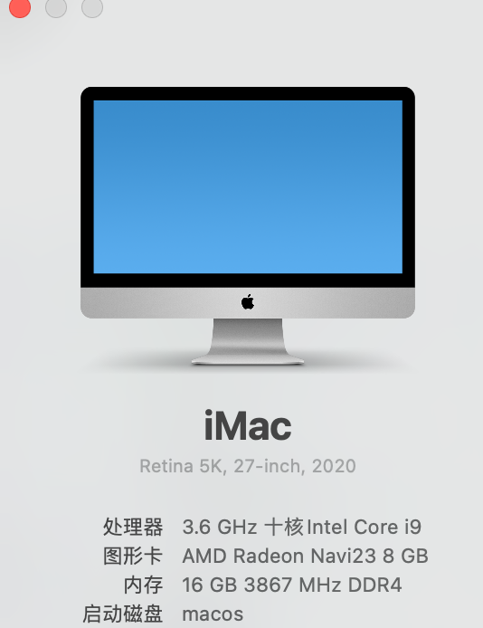

# MSI-Z490A-PRO-i9-10850K-Hackintosh

## Intro 
 
## Hardware

- CPU: Intel i9-10850k Comet Lake
- iGPU: Intel UHD 630
- dGPU: None
- Motherboard: MSI Z490-A-PRO:
- Audio: Realtek ALC892
- Ethernet: 2.5Gbit Realtek RTL8125B-CG
- BlueTooth && WIFI: FV T919 
- USB-C/Thunderbolt port
- RAM: 2x Kingston DDR4 16Gb 3200MHz pc-25600 (KVR32N22S8/16)
- 1x DisplayPort 4k Monitor
- 1x HDMI FullHD Monitor

